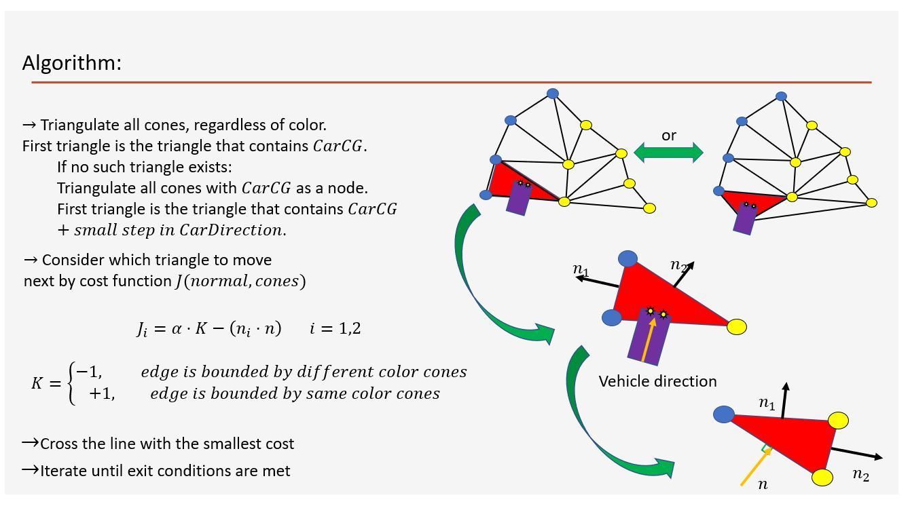

# Formula-PathPlanning-PurePursuit
Path planning from sensed cones via Delaunay Triangulation, Control with Pure Pursuit. Real Data included

## Delaunay Triangualtion based navigation soltuion
1) Matlab simulator
2) Python for real-time as ros node
3) Real expiramental data in Json to be used with Testing.Py

## Pure Pusruit 
1) smart Python implementation without if-else angle wrapping problems.

